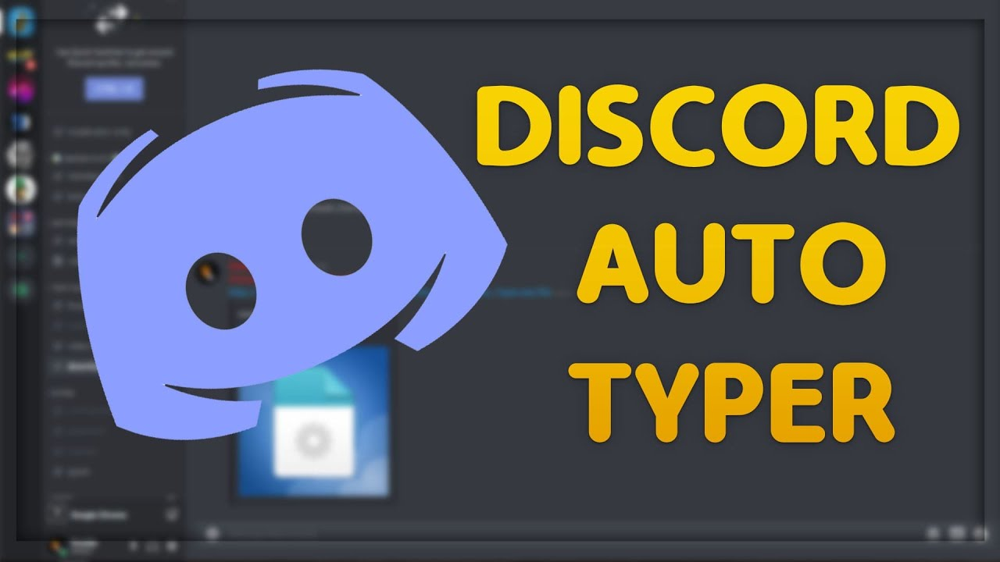

# Discord-AutoType

<p >
    <a href="https://www.python.org/doc/" alt="Python 3.7">
        
    </a>
    
    
</p>  

## What's this?
A small script that allows users to send a message in a Discord channel repeatedly. It even has a few characteristics to make the bot appear more human-like.



## Installation
Open the command line and clone the repo. This will require Git to be installed.
```
% git clone https://github.com/tantikornpoon/Discord-AutoType.git
```
## Usage
Navigate inside of the repo to the script, and run it. This requires Python to be installed.
```
% cd ~/Downloads/Discord-AutoType/
% python3 AutoType.py
```
## Help
The script contains a builtin help command. Invoke it as such:
```
% python3 bot.py --help
```
